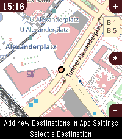
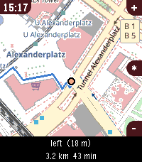
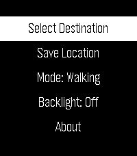
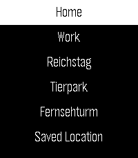
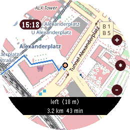
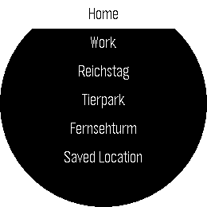
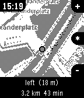

# Navi App

Turn-by-turn navigation for Pebble smartwatches.















## Features

- Turn-by-turn navigation on your wrist
- Map rendering with OpenStreetMap tiles
- Destination selection from saved locations
- Save current location
- Supports Pebble Time 2 (emery), Pebble Time Round (gabbro), and Pebble 2 Duo (flint)

## Architecture

- **`src/c/`** — Watch C code
  - `main.c` — App entry point, message handling, routing state
  - `navigation.c` — Map layer rendering and bitmap management
  - `menu.c` — Menu overlay for destination selection
- **`src/pkjs/`** — Phone-side TypeScript (compiled to JS)
  - `index.ts` — App lifecycle, Pebble message handling
  - `map-handler.ts` — Tile coord fetch and render pipeline
  - `destionations.ts` — Destination list management
  - `server/` — OSM tile fetch, routing (OSRM), Pebble palette rendering, localStorage cache

## Build

```sh
npm run tsc          # TypeScript compile only
npm run build        # tsc + pebble build (full)
npm run start        # build + install to emery emulator
npm run push         # build + install to phone
```

Requires the [Pebble SDK](https://developer.rebble.io/).

## Getting Started

```sh
# Clone and install dependencies
git clone https://github.com/jonny/navi-app
cd navi-app
npm install

# Run on the emery (Pebble Time 2) emulator
npm run start

# Run on gabbro (Pebble Time Round) emulator
npm run debug-round-2

# Build and install to a phone via Pebble app
npm run push

# Debug (build + install + logs)
npm run debug-time-2   # emery
npm run debug-round-2  # gabbro
npm run debug-duo      # flint
```

Before running, start the Pebble emulator from the Pebble SDK, or connect your phone with the Pebble app.

## Phone Settings

Once installed, open the app in the Pebble mobile app and tap the gear icon to configure:

- **Saved Destinations** — Add locations by address (requires an [OpenRouteService](https://openrouteservice.org/) API key) or raw `lat,lng` coordinates; delete existing ones
- **ORS API Key** — Set your OpenRouteService API key for address-based geocoding

Settings are persisted in the phone's `localStorage`.

## Data Attribution

Map data © [OpenStreetMap](https://www.openstreetmap.org) contributors (ODbL).
Routing via [OSRM](http://project-osrm.org/).
See [ATTRIBUTIONS.md](ATTRIBUTIONS.md) for details.

## License

[GNU General Public License v3.0](LICENSE)
